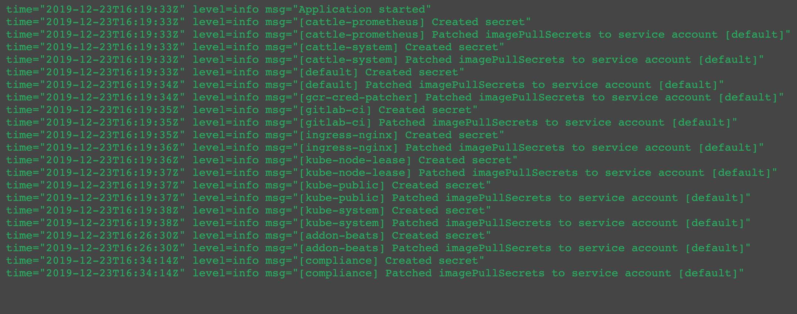

# imagepullsecret-patcher

[](https://travis-ci.org/titansoft-pte-ltd/imagepullsecret-patcher)
[](https://goreportcard.com/report/github.com/titansoft-pte-ltd/imagepullsecret-patcher)


A simple Kubernetes [client-go](https://github.com/kubernetes/client-go) application that creates and patches imagePullSecrets to default service accounts in all Kubernetes namespaces to allow cluster-wide authenticated access to private container registry.



## Installation and configuration

To install imagepullsecret-patcher, can refer to [deploy-example](deploy-example) as a quick-start. 

Below is a table of available configurations:

| Config name | ENV | Command flag | Default value | Description |
|-|-|-|-|-|
| force | CONFIG_FORCE | -force | true | overwrite secrets when not match |
| debug | CONFIG_DEBUG | -debug | false | show DEBUG logs |
| dockerconfigjson | CONFIG_DOCKERCONFIGJSON | -dockerconfigjson | "" | json credential for authenicating container registry |
| secret name | CONFIG_SECRETNAME | -secretname | "image-pull-secret" | name of managed secrets |

## Why

To deploy private images to Kubernetes, we need to provide the credential to the private docker registries in either
- Pod definition (https://kubernetes.io/docs/concepts/containers/images/#specifying-imagepullsecrets-on-a-pod)
- Default service account in a namespace (https://kubernetes.io/docs/tasks/configure-pod-container/configure-service-account/#add-imagepullsecrets-to-a-service-account)

With the second approach, a Kubernetes cluster admin configures the default service accounts in each namespace, and a Pod deployed by developers automatically inherits the image-pull-secret from the default service account in Pod's namespace. 

This is done manually by following command for each Kubernetes namespace.

```
kubectl create secret docker-registry image-pull-secret \
  -n <your-namespace> \
  --docker-server=<your-registry-server> \
  --docker-username=<your-name> \
  --docker-password=<your-pword> \
  --docker-email=<your-email>

kubectl patch serviceaccount default \
  -p "{\"imagePullSecrets\": [{\"name\": \"image-pull-secret\"}]}" \
  -n <your-namespace>
```

And it could be automated with a simple program like imagepullsecret-patcher.

## How

The imagepullsecret-patcher does two things: create a secret called `image-pull-secret` in all namespaces, and patch the `default` service accounts to use those secrets as imagePullSecrets.


## Contribute

Development Environment
- Go 1.13
